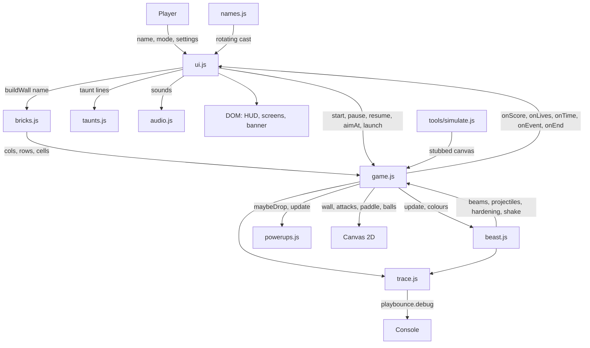

# Architecture

## Project structure

```
playbounce/
├── web/
│   ├── index.html    markup for the canvas, HUD, and three screens
│   ├── style.css     terminal styling and screen visibility
│   ├── trace.js      bounded decision log
│   ├── names.js      the rotating cast, as an editable data block
│   ├── taunts.js     the wall's voice
│   ├── audio.js      Web Audio synthesis
│   ├── bricks.js     bitmap font and name-to-grid conversion
│   ├── powerups.js   hidden perks and falling tokens
│   ├── beast.js      rage, hardening, screams, projectiles, beams
│   ├── game.js       loop, physics, collision, rendering
│   └── ui.js         screens, settings, keyboard, and the DOM wiring
└── tools/
    └── simulate.js   headless balance harness
```

## System diagram



Scripts load in dependency order: `trace`, `names`, `taunts`, `audio`, `bricks`, `powerups`, `beast`, `game`, `ui`. Each attaches to a single `PB` global, and only `playbounce` (the console handle) is exposed beyond that.

## Core components

### trace.js

A 256-record ring buffer plus `playbounce.debug()`. Always on, since instrumentation you have to switch on isn't available at the moment you needed it. Writing a record appends to a capped array; formatting happens only when someone reads it.

### names.js

A data block first, code second. The names live in one plain-text list at the top so anyone can edit it without reading JavaScript. Parsing filters to A-Z, caps at 8 characters, drops duplicates, and records how many survived. It's a `.js` file rather than `.txt` or `.json` on purpose: `fetch` is blocked under `file://`, and the launchers open the game that way.

### bricks.js

Owns the 5x7 bitmap font and nothing else, with no canvas or DOM reference, so the Python port is a transcription rather than a rewrite. `buildWall` returns a flat `Uint8Array` where each entry is a brick's remaining hits, so collision does direct index arithmetic instead of walking objects. Glyphs are parsed from their source strings once at load.

### beast.js

The hostile behaviour, kept out of the physics. It owns rage, the stage machine, hardening cadence, screams, projectiles, and beams, and reports damage back through an `onPaddleHit` hook rather than reaching into the paddle itself. It draws its own attacks and hands out the wall's current colours.

### game.js

`PB.createGame(canvas, callbacks)` returns the engine: canvas, loop, ball and paddle physics, collision, and pointer input. It reports outward through callbacks (`onScore`, `onLives`, `onTime`, `onEvent`, `onEnd`) and never touches the DOM outside its canvas, which is what lets the harness run it headlessly.

### ui.js

Owns the DOM and everything expressive: screens, settings, keyboard routing, the taunt banner, and the mapping from engine events to sounds and lines. Sound and voice live here rather than in the engine so the engine stays testable in Node.

## Layout maths

Everything derives from the canvas size on each layout pass, so there are no fixed pixel dimensions.

| Value | Derivation |
|---|---|
| Grid columns | `6N-1` for an N-letter name (5 per glyph, 1 between) |
| Grid rows | 7 |
| Cell size | `floor(min(0.94 * width / cols, 0.40 * height / rows))`, floor of 4px |
| Wall origin | Centred horizontally, top at `max(0.12 * height, 60px)` |
| Paddle | 20% of width at 10 blocks, clamped to 56-190px, so one block is a tenth of that |
| Ball radius | 1.3% of the smaller viewport dimension, floor of 4px |
| Ball speed | Canvas height per second times 0.55, 0.75, or 1.0 |

Cells stay square, so glyphs keep the font's proportions at any name length. Width binds first in portrait, which is what makes a short name chunky and an 8-letter name small.

## Self-healing and the rage source

Rage is derived from the wall's live brick count (`(total - live) / total`), not from the running score. That one choice is what makes healing work without a second system: regrown bricks lower the rage on their own, which cools the stage, which thins the attacks, all the way back to dormant.

`buildWall` keeps a `mask` alongside `cells` because a destroyed brick and empty space are both zero, so without it a healed wall has no way to know where bricks belong.

The beast updates whether or not a ball is in play, so healing continues while a serve is held and waiting costs progress. Attack spawning is the exception: a held serve means the player just lost a ball and can't act yet, so no new projectiles or beams start and their timers hold in place rather than running down, which stops a queued volley firing the instant they serve. Only the clock and the ball physics wait for the serve.

Healing sheds armour as well as regrowing bricks. Regrown cells come back at one hit, so armour left on the survivors would leave a recovered wall harder than the one that stood there before. Every fourth heal drops `hardness` by one and calls `onSoften`, which reuses the same `softenWall` pass a combo triggers, and hardening is suppressed outright for as long as `healing` is true, its timer holding rather than running down. Without that suppression the two systems fight: measured over the recovery from 4 bricks to full, hardness fell 4 to 1 and then climbed back to 2 while the wall was still cooling, which reads as calming down and re-armouring at once.

Healing arms the first time the wall reaches DYING and then runs whenever it goes 8 seconds without taking a hit. Every heal interval is multiplied by the same pace factor as the attacks, since anything on a clock becomes a difficulty lever tied to wall size otherwise. Measured over 200 harness runs per name, adding healing without that scaling dropped SAMANTHA from 38% to 5% while SUE only fell to 23%; scaled, the three names sit at 28%, 19%, and 21%.

## Difficulty pacing

Attack timers run on the clock, but wall size varies by a factor of nearly three between a 3-letter and an 8-letter name. Left alone, that made your name decide your difficulty: measured over 120 harness runs per name at equal skill, SAMANTHA cleared 5% of the time against ISAAC's 39%.

The beast scales every interval, including hardening, by `bricks / 80` clamped to 0.72-1.75, where 80 is a five-letter wall. Re-measured, the same three names clear at 33%, 29%, and 36%.

## Rendering

Two canvases. The wall draws into an offscreen canvas and is blitted per frame; a brick that takes a hit repaints its own cell, and a full repaint happens only when the beast's colour or the hardening changes. Beams, projectiles, powerup tokens, the paddle's blocks, and the balls draw straight onto the visible canvas. The backing store is scaled by `devicePixelRatio`, capped at 2. Screen shake translates the context after the background fill, so the fill always covers the shifted frame.

## The taunt banner

The wall's height changes with name length, so a banner at a fixed percentage of the viewport falls on the bricks for short names and floats free for long ones. The engine reports the midpoint of the clear band between the wall's bottom edge and the paddle through an `onLayout` callback on every layout pass, and the banner is positioned from that measurement. Confirmed with `getBoundingClientRect()` across one-letter through eight-letter names: the tightest case still clears the wall by 145px and the paddle by 144px.

## Collision

Frame time is clamped to 1/30s, then split into substeps no longer than the smaller of the cell size and the ball radius, capped at 24. Each substep tests walls, then bricks, then the paddle, for every live ball.

Brick collision maps the ball's bounding box to a cell range and tests circle against rectangle per candidate. Every overlapped brick in a substep takes a hit, and the ball reflects once, off the axis it penetrated least. After a reflection the vertical component is forced to at least 22% of the speed, which keeps the ball off a near-horizontal path it could otherwise bounce along indefinitely.

Paddle collision reflects by where along the paddle the ball hit, up to 60 degrees off vertical, at constant speed. Since the outgoing angle is built from the hit offset rather than mirrored, the player steers the ball, and steering is the only offence they have.

## Data stores

None. No backend, no database, no cookies, no local storage, and no network requests after the page loads. Audio is synthesised rather than fetched.

## Security considerations

The name is the only input. It's filtered to A-Z before use and only ever reaches `textContent` and canvas drawing, never `innerHTML`, so there's no injection surface. Nothing leaves the browser.

## Development and testing

`node tools/simulate.js` plays whole games headlessly against a stubbed canvas and reports outcome distributions. It's the right tool for any tuning change, since a single run tells you almost nothing about a system with this much variance.

In the browser, `playbounce.state()` reads current ball, paddle, wall, beast, and live attacks, and `playbounce.debug()` reads the event log. The loop can also be stepped deterministically by replacing `requestAnimationFrame` with a manual driver before starting a game, which makes collision, timeout, and win paths testable without watching an animation.

## Known debt

`tools/simulate.js` stubs the canvas rather than using a headless canvas implementation, so it exercises game logic and never catches a rendering fault. Anything drawn is verified in a browser instead.

The trace ring buffer holds 256 records, which a long TORMENT run overflows in under a minute. Counts read from `playbounce.debug()` after a full game are a recent window, not a total, and the balance harness is the place to get totals.

`bricks.js` and `names.js` carry no canvas or DOM references, which keeps them portable to a non-browser runtime. `beast.js` states its behaviour in seconds and shares rather than pixels wherever it can, for the same reason.

## Glossary

| Term | Meaning |
|---|---|
| Cell | One grid square, whether or not it holds a brick |
| Glyph | One character's 5x7 bitmap |
| Wall | The full grid of cells for a name |
| Substep | One slice of a frame's ball movement, sized so collisions can't be stepped over |
| Rage | Share of the wall destroyed, which drives the beast's stage |
| Pace | Multiplier on every attack interval, derived from wall size |
| Block | One tenth of a full paddle, and the unit beams and projectiles cut away |
